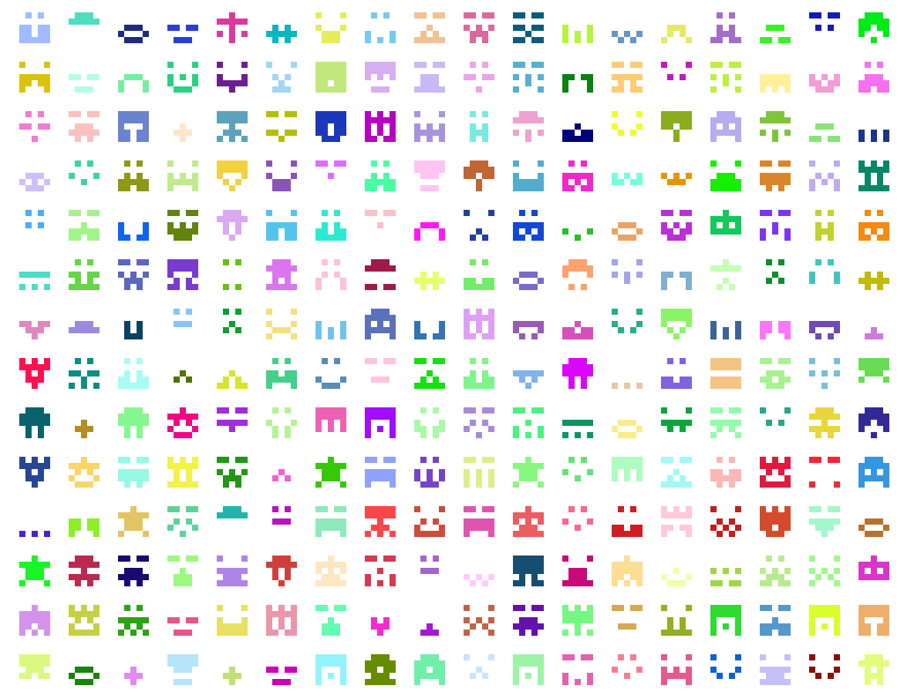

# TrackiconInvaders

TrackiconInvaders is a Space Invaders visual representation of [Spotify Web API](https://developer.spotify.com/web-api/) Based Seeds recommendations.

As a fan of [Space Invaders](https://en.wikipedia.org/wiki/Space_Invaders), I created this kind of experiment code of my version of this game. I used for that purpose [Javascript](https://developer.mozilla.org/en-US/docs/Web/JavaScript), [React](https://facebook.github.io/react/), [p5js](https://p5js.org/) and [Spotify Web API](https://developer.spotify.com/web-api/)

Getting the [Spotify Web API](https://developer.spotify.com/web-api/) recommendations through the music genre selected for the user, the game generates a type of [Identicons / Invaders](https://en.wikipedia.org/wiki/Identicon) as a grid of 5x5 in an attempt to create a classic [Space Invaders](https://en.wikipedia.org/wiki/Space_Invaders) game. Each Invader is generated using the name of the track related to the music genre previously selected.

When the [Identicon / Invader](https://en.wikipedia.org/wiki/Identicon) is destroyed, a 30 seconds preview of the song is played.

  

